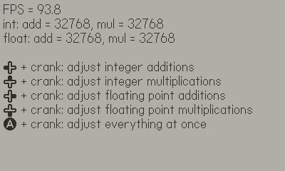
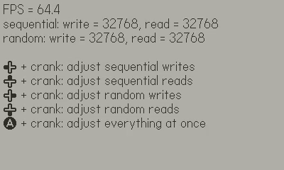
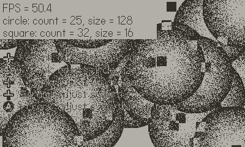
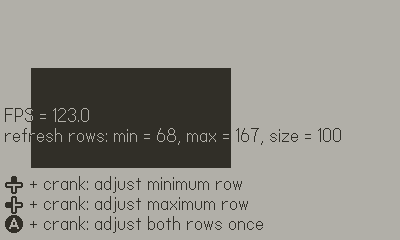
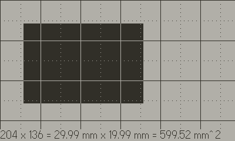

# PDBench

Playdate benchmarks.

https://uguu-org.itch.io/pdbench

## Overview

This is a collection of small benchmarks.  Each benchmark includes a set of parameters that can be adjusted, and reports the measured frame rate that resulted in running the benchmarks using those parameters.  This is meant to provide some rough numbers for guiding design decisions.

All tools use the same control:

+ **Hold direction on D-Pad and turn crank** to adjust a parameter.
+ Hold diagonal direction to adjust two parameters at once.
+ Hold **A** or **B** to adjust all parameters at once.

Menu options:

+ **Reset**: reset current test to initial parameters.
+ **Test**: select which test to run.

### Math test

Test basic add/multiply operations for integer and floating point numbers.  The floating point tests also includes conversion to and from integer operands, so expressions operating on purely floating point numbers may achieve higher throughput rate.

### Memory test

Test memory writes and reads with word-aligned data.  Sequential tests are done before random tests.  Within each test, all writes happen before all reads.  Each random access incurs a few extra arithmetic operations to compute the random addresses.

### Sprite test

Test `drawBitmap` calls with sprites bouncing around the screen.  Circles are drawn with `kDrawModeCopy`, while squares are drawn with `kDrawModeNXOR`.

### Screen test

Test the effect of `markUpdatedRows` on frame rate.  A sweeping rectangle shows which rows are being refreshed.  The rectangle moves one pixel per frame, so you can also use the rectangle speed to gauge frame rate.

### Ruler

Check how much physical area is taken up by some number of pixels.  Use D-Pad to select which edges to adjust, and turn crank to move those edges.

Both metric and imperial rulers are available through the menu.

+ Metric: Dots are spaced 1 mm apart, dotted lines are 5 mm apart, and solid lines are 1 cm apart.
+ Imperial: Dots are spaced 1/32 in apart, dotted lines are 1/8 in apart, and solid lines are 1 in apart.

Starting/resetting ruler mode will create a 1 mm^2 or 1 in^2 rectangular area depending on selected mode.  Switching to the other ruler mode will preserve existing rectangle positions to facilitate unit conversion.

## FAQ

Q: How accurate are these benchmarks?\
A: You can trust the general order of magnitudes of the numbers, but there are many reasons why the numbers may be optimistic or pessimistic.

Q: Why does the frame rate change significantly when I press a button?\
A: A larger screen area will need to be refreshed when a parameter is being adjusted, which tend to result in a significant drop in frame rate.  This effect is best demonstrated in `screen` test.

Q: I set the number of operations very low and now the frame rate is unreadable.\
A: That's because the frame rate now updates too fast.  Holding a button will likely cause a sufficient drop in frame rate to make the number readable.  See previous question.

Q: Can you add this other benchmark?\
A: Probably not, please fork the source code and add it yourself.  In particular, I can't add any network related tests because I can't provide a server that is guaranteed to be up indefinitely.

Q: A ruler is not a benchmark.\
A: No, but it is handy to know how big certain sprites will appear.  As a bonus, a ruler is included in the title card image, so you can measure small objects without starting the app at all.
